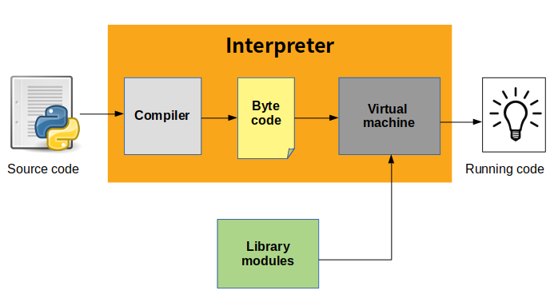
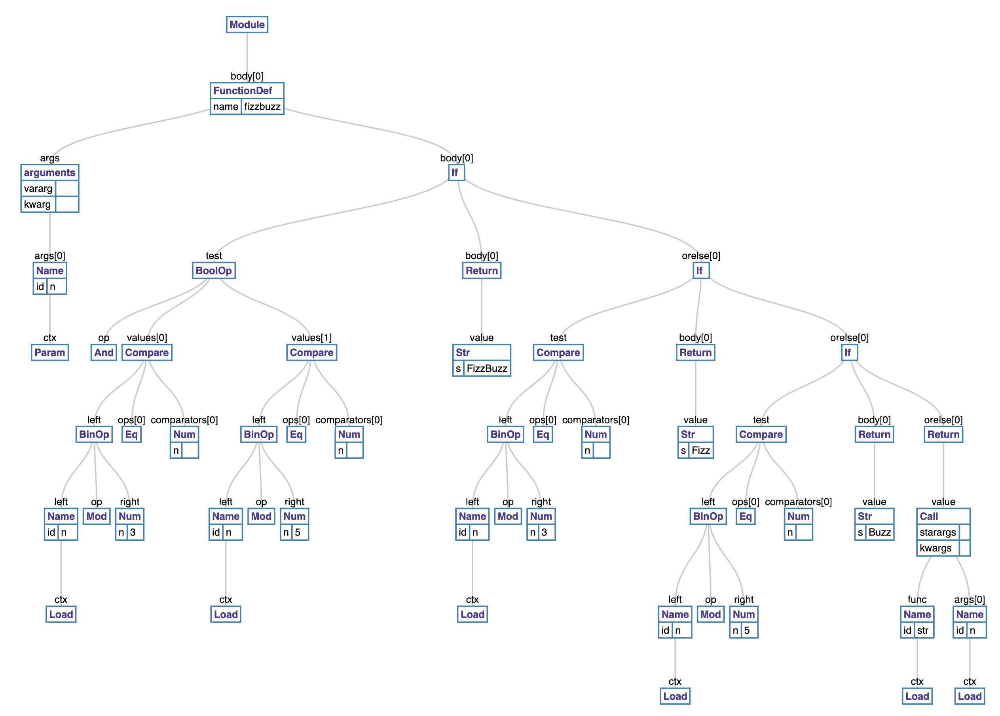
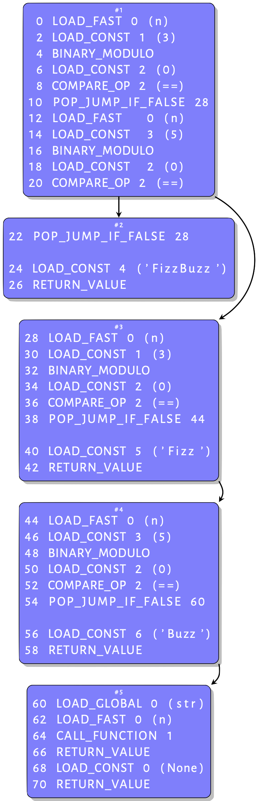

Any programming language need complier or interpreter, that translate source code(human readable) to machine code.

* compiler means : A compiler translates code from a high-level programming language into machine code before the program runs.(ex c,c++,java etc).   

* interpreter means :  An interpreter translates code written in a high-level programming language into machine code line-by-line as the code runs.(ex. python,ruby etc)

* python uses interpreter.
  -interpreter which execute source code line by line.
   
* what does python interepreter do?
  -first source code goes to interpreter.interpreter contain two main parts 1.compiler 2.virtual machine.
    
* what does compiler do?
   -compiler translate compile source code to bytecode instruction.
    
* process of compilation divided into four parts.

      1.parse source code into parse tree.(each node contains part of your code)

      2.parse tree into abstract syntax tree(each node denote construct occurring in source code)

      3.abstract syntax tree into control flow graph(each block contains bytecode representation of program code)

      4.control flow graph into bytecode (bytecode generate from basic blocks of CFG by doing post-order depth first search)
      
* what does virtual machine do?
 -its just big loop that iterates through bytecode instruction, one by one to carry out their operations.
 
 * There is brief video of how does python run? https://youtu.be/ZBr_T7XjrC8?si=UQQwRZdidSSAAH5-

Example:

>1 def fizzbuzz(n):
2  &nbsp; if n % 3 == 0 and n % 5 == 0:
3          &nbsp; &nbsp;  return 'FizzBuzz'
4  &nbsp;  elif n % 3 == 0:
5         &nbsp; &nbsp;  return 'Fizz'
6  &nbsp;  elif n % 5 == 0:
7         &nbsp; &nbsp;  return 'Buzz'
8  &nbsp;  else:
9         &nbsp; &nbsp;  return str(n) 

* Transformation of parse tree into AST(Abstract syntax tree)

* Abstract syntax tree to control Flow graph

- why stack is used by python compiler?  
Stack data structure is used in compiler design for parsing and syntax analysis of programming languages
